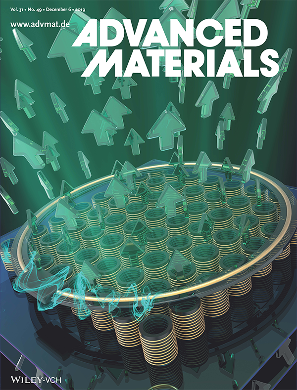
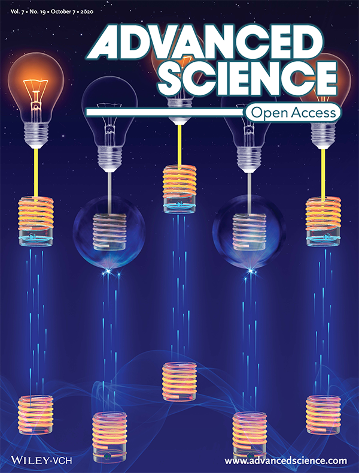
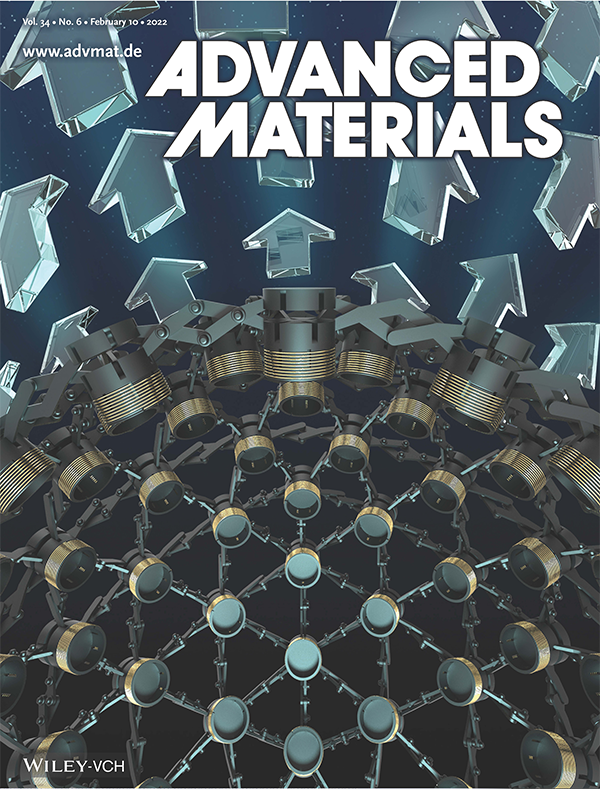
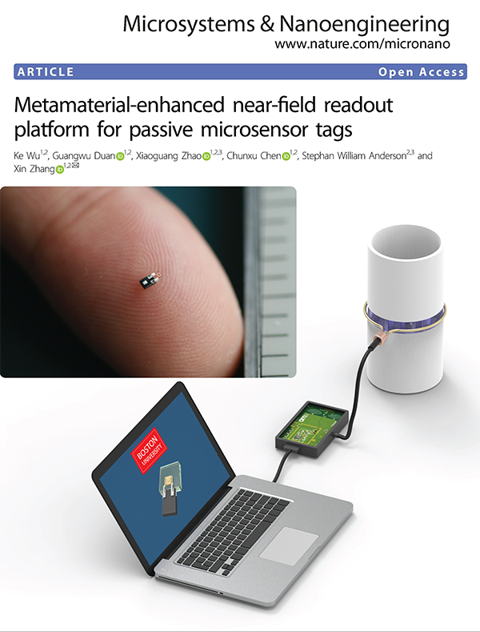
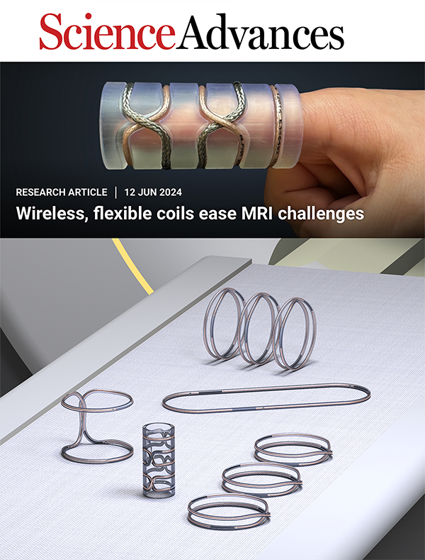
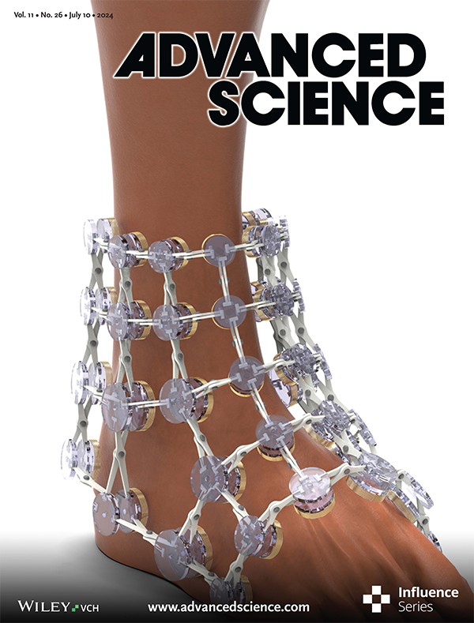

:--------:|:--------:|:--------:|:--------:|:--------:|:--------:
  |    |    |    |    |  

More about my research can be found on [Google Scholar profile](https://scholar.google.com/citations?user=gCnzlpcAAAAJ&hl=en) and [ResearchGate profile](https://www.researchgate.net/profile/Ke-Wu-48/research).

(# contributed equally )

2024
----
[1].	__K. Wu__, X. Zhu, X. Zhao, S.W. Anderson, X. Zhang, “Conformal Metamaterials with Active Tunability and Self-adaptivity for Magnetic Resonance Imaging”. [[arXiv:2310.00153]](https://arxiv.org/abs/2310.00153).

[2].	X. Zhu#, __K. Wu#__, S.W. Anderson, X. Zhang, “A Robust All-textile Near-field Body Area Network Based on Coaxially-shielded Metamaterial”.[[arXiv:2402.13962]](https://arxiv.org/abs/2402.13962).

[3].	__K. Wu#__, X. Zhu#, S.W. Anderson, X. Zhang, “Wireless, Customizable Coaxially-shielded Coils for Magnetic Resonance Imaging”, _Science Advances_ 10(24), p.eadn5195 (2024). [[DOI: 10.1126/sciadv.adn5195]](https://arxiv.org/abs/2312.12581).
* Media Outlets: [[Phy.org]](https://phys.org/news/2024-06-science-metamaterials-mri.html) [[EurekAlert!]](https://www.eurekalert.org/news-releases/1047883) [[Press-News.org]](https://press-news.org/193427-unleashing-the-power-of-metamaterials-to-improve-mri-imaging.html) [[Scienmag]](https://scienmag.com/unleashing-the-power-of-metamaterials-to-improve-mri-imaging/) [[Power Systems Design]](https://www.powersystemsdesign.com/articles/unleashing-the-power-of-metamaterials-to-improve-mri-imaging/33/21757) [[Prova Education]](https://provaeducation.com/news/engineer-explains-the-science-behind-metamaterials-and-mri-enhancement/2467030/) [[Omnia Education]](https://omniaeducation.com/news/engineer-explains-the-science-behind-metamaterials-and-mri-enhancement/2467030/) [[ReachMD]](https://reachmd.com/news/engineer-explains-the-science-behind-metamaterials-and-mri-enhancement/2467030/) [[medtelligence]](https://medtelligence.net/news/engineer-explains-the-science-behind-metamaterials-and-mri-enhancement/2467030/) [[Global Neurology Academy]](https://globalneurologyacademy.org/news/engineer-explains-the-science-behind-metamaterials-and-mri-enhancement/2467030/) [[Axis Medical Education]](https://axismeded.com/news/engineer-explains-the-science-behind-metamaterials-and-mri-enhancement/2467030/) [[Bioengineer.org]](https://bioengineer.org/unleashing-the-power-of-metamaterials-to-improve-mri-imaging/) [[Mirage]](https://www.miragenews.com/metamaterials-boost-mri-imaging-power-1254720/) [[Life Technology]](https://www.lifetechnology.com/blogs/life-technology-science-news/engineer-explains-the-science-behind-metamaterials-and-mri-enhancement?_pos=1&_sid=b02dc215a&_ss=r) [[Microsoft Start]](https://www.msn.com/en-us/health/other/engineer-explains-the-science-behind-metamaterials-and-mri-enhancement/ar-BB1o6AWc) [[Rheumatology Academy]](https://rheumatologyacademy.org/news/engineer-explains-the-science-behind-metamaterials-and-mri-enhancement/2467030/)

[4].	__K. Wu__, X. Zhu, T.G. Bifano, S.W. Anderson, X. Zhang. “Computational-design Enabled Wearable and Tunable Metamaterials via Freeform Auxetics for Magnetic Resonance Imaging”, _Advanced Science_ 11, p.2400261 (2024). [[DOI:10.1002/advs.202400261]](https://onlinelibrary.wiley.com/doi/full/10.1002/advs.202400261) [[Cover Image]](https://onlinelibrary.wiley.com/doi/10.1002/advs.202470152)

[5].	X. Zhu#, __K. Wu#__, S.W. Anderson, X. Zhang, “Wearable Coaxially-shielded Metamaterial for Magnetic Resonance Imaging”, _Advanced Materials_, p.2313692 (2024).  [[DOI:10.1002/adma.202313692]](https://onlinelibrary.wiley.com/doi/full/10.1002/adma.202313692).

2023
----
[6].	X. Zhu#, __K. Wu#__, S.W. Anderson, X. Zhang, “Helmholtz Coil-Inspired Volumetric Wireless Resonator for Magnetic Resonance Imaging”, _Advanced Materials Technologies_ 8, 2301053 (2023). [[DOI:10.1002/admt.202301053]](https://onlinelibrary.wiley.com/doi/full/10.1002/admt.202301053).

2022
----
[7].	__K. Wu#__, G. Duan#, X. Zhao#, C. Chen, S.W. Anderson, X. Zhang. “Metamaterial-enhanced, near-field readout platform for passive microsensor tags”, _Microsystems & Nanoengineering – Nature_ 8, 28 (2022). [[DOI: 10.1038/s41378-022-00356-4]](https://www.nature.com/articles/s41378-022-00356-4).

[8].	__K. Wu#__, X. Zhao#, T.G. Bifano, S. W. Anderson, X. Zhang, “Auxetics-Inspired Tunable Metamaterials for Magnetic Resonance Imaging,” _Advanced Materials_ 34, 2109032 (2022). [[DOI: 10.1002/adma.202109032]](https://onlinelibrary.wiley.com/doi/10.1002/adma.202109032) [[Cover Image]](https://onlinelibrary.wiley.com/doi/epdf/10.1002/adma.202270049) [[YouTube]](https://www.youtube.com/watch?v=clDsqm8l6Kw&t=1s&ab_channel=BostonUniversity)

* Media Outlets: [[Science Daily]](https://www.sciencedaily.com/releases/2022/02/220211102727.htm) [[Medical Xpress]](https://medicalxpress.com/news/2022-02-bizarre-helmet-brain-scans.html) [[Neuroscience News]](https://neurosciencenews.com/metamaterial-mri-helmet-20057/) [[HealthImaging]](https://healthimaging.com/topics/medical-imaging/magnetic-resonance-imaging-mri/wearable-mri-helmet) [[Medical Republic]](https://www.medicalrepublic.com.au/you-can-keep-your-hat-on-in-the-mri/6869) [[Dispositivos Medicos]](https://dispositivosmedicos.org.mx/casco-de-material-magnetico-portatil-para-rm-mas-rapidas-y-de-bajo-costo/) [[Tech Briefs]](https://www.techbriefs.com/component/content/article/45400-5-ws-of-a-wearable-metamaterial) [[Noticias de la Ciencia]](https://noticiasdelaciencia.com/art/43847/un-casco-tan-util-como-llamativo) [[Technology Networks]](https://www.technologynetworks.com/tn/news/the-strange-looking-helmet-that-can-improve-brain-scans-358521) [[NewsBeezer]](https://newsbeezer.com/germanyeng/this-bizarre-looking-helmet-can-do-better-brain-scans/)

2020
----
[9].	C. Chen, Y. Huang, __K. Wu__, T. G. Bifano, S. W. Anderson, X. Zhao, X. Zhang, “Polarization Insensitive, Metamaterial absorber-enhanced long-wave infrared detector,” _Optics Express_ 28, pp 28843–28857 (2020). [[DOI: 10.1364/OE.403105]](https://opg.optica.org/oe/fulltext.cfm?uri=oe-28-20-28843&id=439585) 

[10].	X. Zhao, __K. Wu__, C. Chen, T. G. Bifano, S. W. Anderson, X. Zhang, “Nonreciprocal magnetic coupling using nonlinear meta-atoms,” _Advanced Science_ 7, 2001443 (2020). [[DOI: 10.1002/advs.202001443]](https://onlinelibrary.wiley.com/doi/full/10.1002/advs.202001443) [[Cover Image]](https://onlinelibrary.wiley.com/doi/epdf/10.1002/advs.202070109) 

2019
----
[11].	X. Zhao, G. Duan, __K. Wu__, S. W. Anderson, X. Zhang, “Intelligent Metamaterials Based on Nonlinearity for Magnetic Resonance Imaging,” _Advanced Materials_ 31, 1905461 (2019). [[DOI: 10.1002/adma.201905461]](https://onlinelibrary.wiley.com/doi/10.1002/adma.201905461) [[Cover Image]](https://onlinelibrary.wiley.com/doi/epdf/10.1002/adma.201970343) [[YouTube]](https://www.youtube.com/watch?v=bsTsoRIDJ3I&ab_channel=BostonUniversity)

* Media Outlets: [[Science Daily]](https://www.sciencedaily.com/releases/2019/11/191105113503.htm) [[Physics World]](https://physicsworld.com/a/non-linear-metamaterials-improve-mr-imaging/) [[Phys.org]](https://phys.org/news/2019-11-intelligent-metamaterial-mris-accessible.html) [[The Medical News]](https://www.news-medical.net/news/20191105/New-intelligent-metamaterial-could-make-MRI-faster-safer-and-more-accessible.aspx) [[MedImaging.net]](https://www.medimaging.net/general-imaging/articles/294780035/nonlinear-metamaterials-could-revolutionize-mri-scanning.html) [[HealthImaging]](https://healthimaging.com/topics/medical-imaging/diagnostic-imaging/metamaterial-can-make-mri-scans-safer-and-cheaper) [[Lifeboat Foundation]](https://lifeboat.com/blog/2019/11/researchers-design-intelligent-metamaterial-to-make-mris-affordable-and-accessible)

2017
----
[12].	Y. Li, Y. Li, Q. Min, __K. Wu__, E. Liu, R. Hao, H. Chen, C. Zhuo, W. Yin, Z. Wang, H. Yu, E. Li, “Electromagnetic Characteristics of Multiport TSVs Using L-2L De-Embedding Method and Shielding TSVs,” _IEEE Transactions on Electromagnetic Compatibility_ 59(5), 17122284 (2017). [[DOI: 10.1109/TEMC.2017.2664047]](https://ieeexplore.ieee.org/document/7879241) 

[13].	__K. Wu__, Z. Wang, “High-Frequency Characterization of Through-Silicon-Vias with Benzocyclobutene Liners,” _IEEE Transactions on Components, Packaging and Manufacturing Technology_ 7(11), 17284709 (2017). [[DOI: 10.1109/TCPMT.2017.2751480]](https://ieeexplore.ieee.org/abstract/document/8067644) 

2016
----
[14].	C. Huang, __K. Wu__, Z. Wang, “Mechanical Reliability Testing of Air-Gap Through-Silicon Vias,” _IEEE Transactions on Components, Packaging and Manufacturing Technology_ 6(5), 16002785 (2016). [[DOI: 10.1109/TCPMT.2016.2544762]](https://ieeexplore.ieee.org/document/7452390) 

[15].	C. Huang, __K. Wu__, Z. Wang, “Low-Capacitance Through-Silicon-Vias with Combined Air/SiO2 Liners,” _IEEE Transactions on Electron Devices_ 63(2), 15720238 (2016). [[DOI: 10.1109/TED.2015.2504093]](https://ieeexplore.ieee.org/document/7359156) 

[16].	Q. Ma, __K. Wu__, Z. Wang, “Thermal Stresses of TSVs With Silicon Post Conductors and Polymer Insulators,” _IEEE Transactions on Components, Packaging and Manufacturing Technology_ 6(12), 16581521 (2016). [[DOI: 10.1109/TCPMT.2016.2620984]](https://ieeexplore.ieee.org/document/7748460) 
